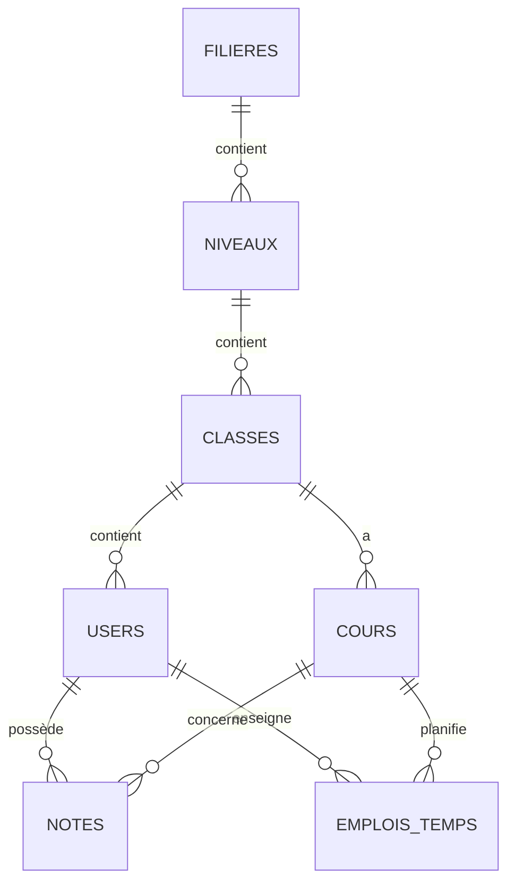

# 🎓 ASEET - Système de Gestion Académique

Application web moderne de gestion académique pour établissements d'enseignement supérieur, développée avec **React + TypeScript** (Frontend) et **Laravel** (Backend).


---

## 📋 Table des matières

- [Fonctionnalités](#-fonctionnalités)
- [Technologies](#-technologies)
- [Prérequis](#-prérequis)
- [Installation](#-installation)
- [Configuration](#-configuration)
- [Utilisation](#-utilisation)
- [Architecture](#-architecture)
- [Documentation](#-documentation)
- [Sécurité](#-sécurité)
- [Déploiement](#-déploiement)
- [Contribuer](#-contribuer)
- [Licence](#-licence)

---

## ✨ Fonctionnalités

### 🔐 Authentification & Autorisation
- Système d'authentification JWT sécurisé
- Gestion de rôles (Admin, Enseignant, Étudiant)
- Protection des routes selon les rôles
- Gestion de sessions avec auto-déconnexion

### 👨‍💼 Espace Administrateur
- **Dashboard** : Vue d'ensemble des statistiques
- **Gestion des utilisateurs** : Étudiants, Enseignants, Admins
- **Gestion académique** : Filières, Niveaux, Classes, Cours
- **Emplois du temps** : Création et gestion centralisée

### 👨‍🏫 Espace Enseignant
- **Dashboard personnalisé** : Stats et cours du jour
- **Gestion des notes** : Ajout, modification, suppression
- **Mon emploi du temps** : Vue grille et liste
- **Mes cours** : Liste des cours assignés

### 🎓 Espace Étudiant
- **Dashboard interactif** : Notes, moyennes, statistiques
- **Mes notes** : Consultation détaillée avec graphiques
- **Mes cours** : Informations sur les cours suivis
- **Mon emploi du temps** : Consultation hebdomadaire

---

## 🛠 Technologies

### Frontend
- **React 18** - Bibliothèque UI moderne
- **TypeScript** - Typage statique
- **Vite** - Build tool ultra-rapide
- **TailwindCSS** - Framework CSS utility-first
- **Framer Motion** - Animations fluides
- **Zustand** - Gestion d'état légère
- **Axios** - Client HTTP
- **React Router** - Routing SPA

### Backend
- **Laravel 11** - Framework PHP moderne
- **MySQL** - Base de données relationnelle
- **Sanctum** - Authentification API
- **Eloquent ORM** - Gestion de données élégante

### Outils & DevOps
- **Git** - Contrôle de version
- **Composer** - Gestionnaire de dépendances PHP
- **npm** - Gestionnaire de dépendances JS
- **ESLint** - Linter JavaScript
- **Prettier** - Formatage de code

---

## 📦 Prérequis

### Système
- **Node.js** >= 18.0
- **npm** >= 9.0
- **PHP** >= 8.2
- **Composer** >= 2.6
- **MySQL** >= 8.0

### Extensions PHP Requises
```
- BCMath
- Ctype
- Fileinfo
- JSON
- Mbstring
- OpenSSL
- PDO
- Tokenizer
- XML
```

---

## 🚀 Installation

### 1. Cloner le Projet
```bash
git clone https://github.com/gourbalissakh/projet_aseet_gourbal.git
cd projet_aseet_gourbal
```

### 2. Configuration Backend

```bash
# Accéder au dossier backend
cd backend

# Installer les dépendances
composer install

# Copier le fichier d'environnement
copy .env.example .env

# Générer la clé de l'application
php artisan key:generate

# Configurer la base de données dans .env
# DB_DATABASE=aseet_db
# DB_USERNAME=root
# DB_PASSWORD=

# Créer la base de données
mysql -u root -p -e "CREATE DATABASE aseet_db;"

# Exécuter les migrations et seeders
php artisan migrate:fresh --seed

# Lancer le serveur
php artisan serve
# API disponible sur http://localhost:8000
```

### 3. Configuration Frontend

```bash
# Ouvrir un nouveau terminal
cd frontend

# Installer les dépendances
npm install

# Copier le fichier d'environnement
copy .env.example .env

# Configurer l'URL de l'API dans .env
# VITE_API_URL=http://localhost:8000/api

# Lancer le serveur de développement
npm run dev
# Application disponible sur http://localhost:5173
```

---

## ⚙️ Configuration

### Variables d'Environnement Backend (.env)
```env
APP_NAME=ASEET
APP_ENV=local
APP_KEY=base64:...
APP_DEBUG=true
APP_URL=http://localhost:8000

DB_CONNECTION=mysql
DB_HOST=127.0.0.1
DB_PORT=3306
DB_DATABASE=aseet_db
DB_USERNAME=root
DB_PASSWORD=

SANCTUM_STATEFUL_DOMAINS=localhost:5173
SESSION_DOMAIN=localhost
```

### Variables d'Environnement Frontend (.env)
```env
VITE_API_URL=http://localhost:8000/api
```

---

## 📱 Utilisation

### Comptes de Test

Après le seed, utilisez ces comptes pour vous connecter :

#### Administrateur
```
Email: admin@aseet.sn
Mot de passe: password
```

#### Enseignant
```
Email: enseignant@aseet.sn
Mot de passe: password
```

#### Étudiant
```
Email: etudiant@aseet.sn
Mot de passe: password
```

### Navigation

1. **Connexion** : Accédez à `http://localhost:5173/login`
2. **Tableau de bord** : Redirection automatique selon le rôle
3. **Menu latéral** : Navigation entre les différentes sections
4. **Profil** : Modification des informations personnelles

---

## 🏗 Architecture

### Structure Frontend
```
frontend/
├── src/
│   ├── assets/          # Images, fonts, fichiers statiques
│   ├── components/      # Composants réutilisables
│   │   └── ProtectedRoute.tsx
│   ├── config/          # Configuration centralisée
│   │   └── constants.ts
│   ├── layouts/         # Layouts (Admin, Enseignant, Étudiant)
│   ├── pages/           # Pages de l'application
│   │   ├── enseignant/  # Pages enseignant
│   │   └── ...
│   ├── services/        # Services API
│   │   ├── api.ts
│   │   └── auth.service.ts
│   ├── stores/          # Gestion d'état Zustand
│   │   └── authStore.ts
│   ├── types/           # Types TypeScript
│   │   └── index.ts
│   ├── utils/           # Utilitaires
│   │   ├── errorHandler.ts
│   │   └── validators.ts
│   ├── App.tsx          # Composant principal
│   └── main.tsx         # Point d'entrée
├── public/              # Fichiers publics
└── package.json
```

### Structure Backend
```
backend/
├── app/
│   ├── Http/
│   │   └── Controllers/ # Contrôleurs API
│   ├── Models/          # Modèles Eloquent
│   └── Providers/       # Service providers
├── config/              # Configuration Laravel
├── database/
│   ├── migrations/      # Migrations de base de données
│   └── seeders/         # Données de test
├── routes/
│   ├── api.php          # Routes API
│   └── web.php          # Routes web
└── storage/             # Fichiers de stockage
```

### Schéma de Base de Données



---

## 📚 Documentation

### Documentation Technique
- **[SECURITE.md](frontend/SECURITE.md)** - Guide de sécurité et bonnes pratiques
- **[DEBOGAGE.md](frontend/DEBOGAGE.md)** - Guide de résolution de problèmes
- **[RAPPORT_VERIFICATION.md](frontend/RAPPORT_VERIFICATION.md)** - Rapport d'audit complet

### Documentation Backend
- **[DEMARRAGE.md](backend/DEMARRAGE.md)** - Guide de démarrage backend
- **[SCHEMA_RELATIONS.md](backend/SCHEMA_RELATIONS.md)** - Schéma relationnel de la BD

### API Documentation

Les endpoints API suivent le pattern REST standard :

```
POST   /api/login          - Connexion
POST   /api/register       - Inscription
POST   /api/logout         - Déconnexion
GET    /api/user           - Utilisateur connecté

GET    /api/cours          - Liste des cours
POST   /api/cours          - Créer un cours
GET    /api/cours/{id}     - Détails d'un cours
PUT    /api/cours/{id}     - Modifier un cours
DELETE /api/cours/{id}     - Supprimer un cours

GET    /api/notes          - Liste des notes
POST   /api/notes          - Ajouter une note
PUT    /api/notes/{id}     - Modifier une note
DELETE /api/notes/{id}     - Supprimer une note

... (et plus)
```

---

## 🔒 Sécurité

### Mesures Implémentées

✅ **Frontend**
- Validation des inputs côté client
- Gestion centralisée des erreurs
- Protection XSS (React par défaut)
- Gestion sécurisée des tokens JWT
- Timeout sur les requêtes API (10s)
- Typage strict TypeScript (0 `any`)

✅ **Backend**
- Authentification JWT avec Laravel Sanctum
- Validation des données côté serveur
- Protection CSRF
- Mots de passe hashés (bcrypt)
- Relations Eloquent sécurisées
- CORS configuré

### Bonnes Pratiques

Consultez [SECURITE.md](frontend/SECURITE.md) pour :
- Guide d'utilisation d'ErrorHandler
- Validation des données
- Configuration centralisée
- Checklist de sécurité complète

---

## 🚢 Déploiement

### Production Frontend

```bash
cd frontend

# Build de production
npm run build

# Les fichiers sont dans dist/
# Déployer sur Netlify, Vercel, ou serveur web
```

### Production Backend

```bash
cd backend

# Optimisation
composer install --optimize-autoloader --no-dev
php artisan config:cache
php artisan route:cache
php artisan view:cache

# Configuration .env
APP_ENV=production
APP_DEBUG=false

# Permissions
chmod -R 755 storage bootstrap/cache
```

### Hébergement Recommandé

#### Frontend
- ✅ **Vercel** - Déploiement automatique depuis Git
- ✅ **Netlify** - CI/CD intégré
- ✅ **GitHub Pages** - Gratuit pour projets publics

#### Backend
- ✅ **DigitalOcean** - VPS Linux complet
- ✅ **AWS EC2** - Cloud scalable
- ✅ **Heroku** - PaaS simple (avec addon MySQL)

#### Base de Données
- ✅ **PlanetScale** - MySQL serverless
- ✅ **AWS RDS** - MySQL managé
- ✅ **Railway** - PostgreSQL/MySQL gratuit

---

## 🤝 Contribuer

Les contributions sont les bienvenues !

### Processus

1. **Fork** le projet
2. **Créer** une branche (`git checkout -b feature/AmazingFeature`)
3. **Commit** les changements (`git commit -m 'Add AmazingFeature'`)
4. **Push** vers la branche (`git push origin feature/AmazingFeature`)
5. **Ouvrir** une Pull Request

### Standards de Code

- **TypeScript** : Typage strict, pas de `any`
- **React** : Hooks, composants fonctionnels
- **CSS** : TailwindCSS, pas de CSS inline
- **Laravel** : PSR-12, Eloquent pour les requêtes
- **Git** : Commits clairs et atomiques

---

## 📊 Fonctionnalités à Venir

### Phase 2 (Q1 2026)
- [ ] Messagerie interne enseignant-étudiant
- [ ] Notifications push en temps réel
- [ ] Export PDF des relevés de notes
- [ ] Calendrier académique interactif
- [ ] Application mobile (React Native)

### Phase 3 (Q2 2026)
- [ ] Paiement en ligne des frais
- [ ] Bibliothèque numérique
- [ ] Forum de discussion par cours
- [ ] Système de présence par QR Code
- [ ] Tableau de bord analytique avancé

---

## 🐛 Bugs Connus

Aucun bug critique actuellement. Consultez les [Issues GitHub](https://github.com/gourbalissakh/projet_aseet_gourbal/issues) pour les problèmes mineurs.

---

## 📞 Support

Pour toute question ou problème :

1. 📖 Consulter la [documentation](frontend/DEBOGAGE.md)
2. 🐛 Ouvrir une [issue GitHub](https://github.com/gourbalissakh/projet_aseet_gourbal/issues)
3. 📧 Contacter : gourbalissakh@example.com

---

## 📝 Changelog

### Version 1.0.0 (27 novembre 2025)
- ✨ Lancement initial de l'application
- ✅ Authentification complète
- ✅ Dashboards pour tous les rôles
- ✅ Gestion des notes
- ✅ Gestion des emplois du temps
- ✅ Animations Framer Motion
- ✅ Design moderne et responsive
- ✅ Documentation complète

---

## 👥 Auteurs

- **Gourbal Issakh** - *Développeur Principal* - [@gourbalissakh](https://github.com/gourbalissakh)

---

## 📄 Licence

Ce projet est sous licence **MIT**. Voir le fichier [LICENSE](LICENSE) pour plus de détails.

---

## 🙏 Remerciements

- React Team pour l'excellent framework
- Laravel Team pour le framework backend
- TailwindCSS pour le système de design
- Framer Motion pour les animations
- Communauté open-source

---

## 📈 Stats du Projet


---

<div align="center">
  
**Fait avec ❤️ pour l'éducation sénégalaise**

[⬆ Retour en haut](#-aseet---système-de-gestion-académique)

</div>
